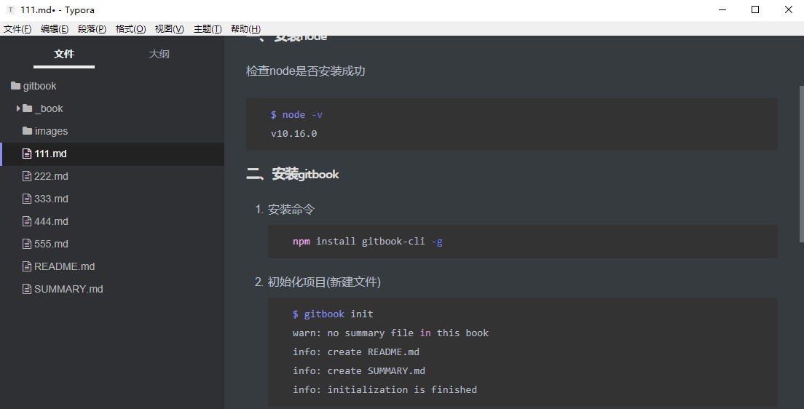
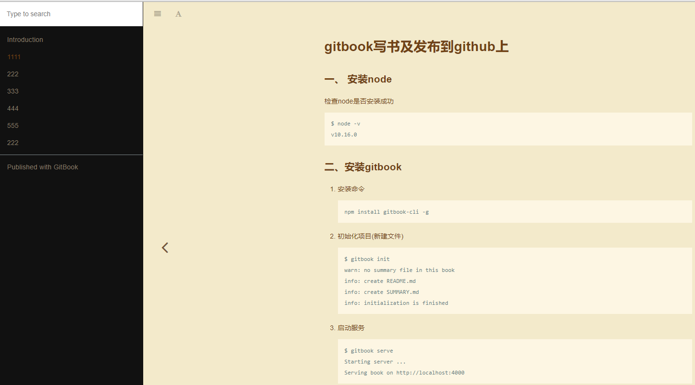

---

---

# 使用gitbook搭建博客

### 一、 安装node

检查node是否安装成功

```shell
$ node -v
v10.16.0
```

### 二、安装gitbook

1. 安装命令

   ```shell
   npm install gitbook-cli -g
   ```

2. 初始化项目(新建文件)

   ```shell
   $ gitbook init
   warn: no summary file in this book
   info: create README.md
   info: create SUMMARY.md
   info: initialization is finished
   ```

3. 启动服务，然后在浏览器地址栏中输入 `http://localhost:4000` 便可预览书籍

   ```shell
   $ gitbook serve
   Starting server ...
   Serving book on http://localhost:4000
   ```

4. 更多命令介绍

   ```shell
   gitbook build  #生成网页而不开启服务器
   
   ```

   

### 三、文件介绍

1. 使用`gitbook init`后会自动生成两个文件`README.md`和`SUMMARY.md`

   * `README.md`使用过`git`的都知道这个文件
   * `SUMMARY.md`就是自己要写文章**章节目录**

2. 系统文件目录如下

   

3. 发布后网页样式

   

### 四、通过配置文件来配置

1. 在书籍下面都可以创建一个`book.json`

   ```shell
   {
     "title": "标题",
     "author": "作者",
     "description": "简单描素",
     "language": "zh-hans", 
     "gitbook": "3.2.3", 
     "styles": {
       "website": "./styles/website.css" 
     },
     "structure": {
       "readme": "README.md" 
     },
     "links": {
       "sidebar": {
         "我的博客": "https://blog.csdn.net/kuangshp128" 
       }
     },
     "plugins": [ 
       "-sharing",
       "splitter",
       "expandable-chapters-small",
       "anchors",
   
       "github",
       "github-buttons",
       "donate",
       "sharing-plus",
       "anchor-navigation-ex",
       "favicon"
     ],
     "pluginsConfig": {
       "github": {
         "url": "https://github.com/kuangshp/"
       },
       "github-buttons": {
         "buttons": [{
           "user": "kuangshp",
           "repo": "mysql",
           "type": "star",
           "size": "small",
           "count": true
         }]
       },
       "donate": {
         "alipay": "./source/images/donate.png",
         "title": "",
         "button": "赞赏",
         "alipayText": " "
       },
       "sharing": {
         "douban": false,
         "facebook": false,
         "google": false,
         "hatenaBookmark": false,
         "instapaper": false,
         "line": false,
         "linkedin": false,
         "messenger": false,
         "pocket": false,
         "qq": false,
         "qzone": false,
         "stumbleupon": false,
         "twitter": false,
         "viber": false,
         "vk": false,
         "weibo": false,
         "whatsapp": false,
         "all": [
           "google", "facebook", "weibo", "twitter",
           "qq", "qzone", "linkedin", "pocket"
         ]
       },
       "anchor-navigation-ex": {
         "showLevel": false
       },
       "favicon": {
         "shortcut": "./source/images/favicon.jpg",
         "bookmark": "./source/images/favicon.jpg",
         "appleTouch": "./source/images/apple-touch-icon.jpg",
         "appleTouchMore": {
           "120x120": "./source/images/apple-touch-icon.jpg",
           "180x180": "./source/images/apple-touch-icon.jpg"
         }
       }
     }
   }
   ```

2. 关于`book.json`字段的介绍

   * title: 书籍标题
   * author:书籍作者
   * description: 本书描述
   * language:语言(中文设置 "zh-hans" 即可)
   * gitbook:gitbook的版本
   * styles:自定义样式
   * structure: readme文件的位置(指定 Readme、Summary、Glossary 和 Languages 对应的文件名)
   * links:链接跳转{在左侧导航栏添加链接信息}
   * plugins:插件
   * pluginsConfig:配置插件的属性

3. 插件介绍

   * GitBook 有 [插件官网](https://docs.gitbook.com/v2-changes/important-differences)，默认带有 5 个插件，highlight、search、sharing、font-settings、livereload，如果要去除自带的插件， 可以在插件名称前面加 `-`，比如：

     ```shell
     "plugins": [
         "-search"
     ]
     ```

   * 如果要配置使用的插件可以在 book.json 文件中加入即可，比如我们添加 [plugin-github](https://github.com/dolojia)，我们在 book.json 中加入配置如下即可：

     ```shell
     {
         "plugins": [ "github" ],
         "pluginsConfig": {
             "github": {
                 "url": "https://github.com/dolojia"
             }
         }
     }
     ```

     然后在终端输入 `gitbook install ./` 即可。

     如果要指定插件的版本可以使用 plugin@0.3.1，因为一些插件可能不会随着 GitBook 版本的升级而升级。

### 五、发布到github

* 在git上创建项目`gitbook`

- 将本地gitbook文件与GitHub上项目同步

  ```shell
  gi$ git init
  $ git add .
  $ git commit -m "first commit"
  $ git remote add origin https://github.com/dolojia/gitboook.git
  $ git push -u origin master
  ```

* 在本地创建`gh-pages`分支

  ```shell
  $ git checkout -b gh-pages
  $ git push
  $ git push --set-upstream origin gh-pages
  ```

​		删除分支下文件，只保留`_book/`目录下文件的文件及`.git`文件夹，提交文件至`gh-pages`分支。

- 提交完成后到github仓库的设置中看一下，gh-pages服务是否自动开启，如果没有的话在`Source`中选择`gh-pages branch`，保存刷新，等待几分钟就好了


### 六、自动发发布脚本

   * 以上操作过于繁杂，避免每次更新文件都要倒腾，写一个自动提交代码脚本自动同步代码至`master`跟`gh-pages`分支，创建文件`push-gitbook.sh`,内容如下：

     ```shell
     cd gitbook &&\
     git checkout master &&\
     git pull &&\
     gitbook init &&\
     gitbook build &&\
     git add . &&\
     git commit -m 'update gitbook' &&\
     git push origin master &&\
     git checkout gh-pages &&\
     rm -rf * &&\
     git checkout master -- _book &&\
     mv _book/* ./ &&\
     rm -rf _book &&\
     rm -rf publish.sh &&\
     git add . &&\
     git commit -m 'push-gitbook.sh gh-pages' &&\
     git push origin gh-pages &&\
     git checkout master
     ```

### 七、END

* 至此全部操作已经完成，接下来每次在本地更新书籍内容后，先生成静态页面，然后提交`master`分支，再提交、`gh-pages`分支就可以了。
* 最后通过下面地址访问线上内容： `https://dolojia.github.io/gitbook`

